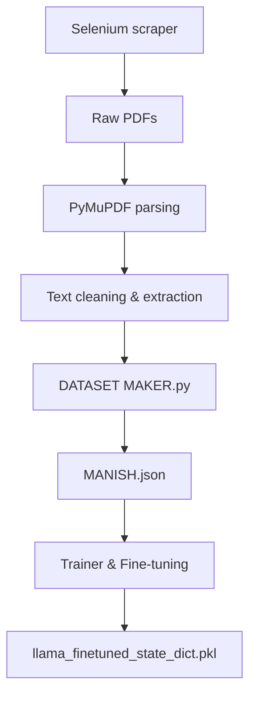
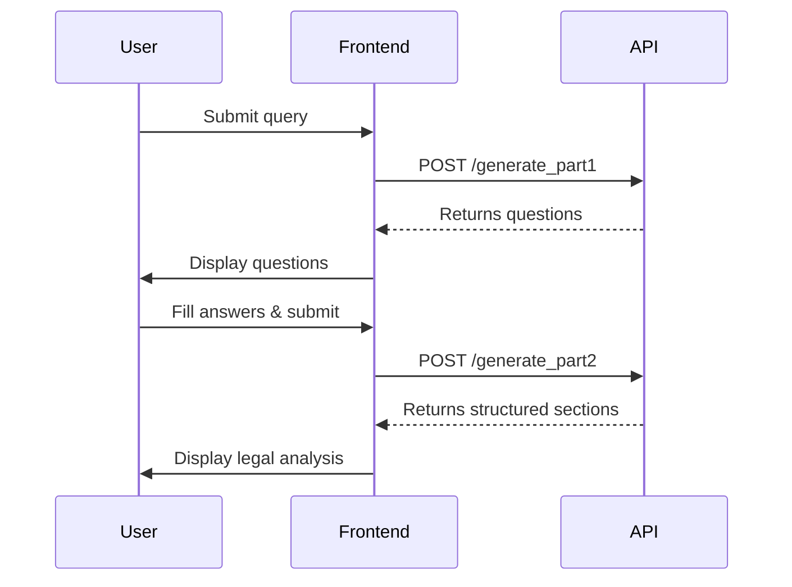

<div align="center">

# ⚖️ LEXISIGHT

### AI Lawyer Assistant for Indian Contract Law


---

**LEXISIGHT** is an end-to-end AI Lawyer Assistant focused on **Indian Contract Law**. It ingests court judgments, prepares a structured dataset, fine-tunes a LLaMA-3.2-1B model, and exposes an inference API (FastAPI) used by a React frontend. The system generates clarifying questions and a structured legal analysis (relevant sections, procedures, strategy, estimated outcome).

[Getting Started](#-quickstart--run-in-google-colab-recommended-for-dev--demo) •
[Documentation](#-project-overview) •
[API Reference](#-inference-api--endpoints) •
[Contributing](#-contributors--contact)

</div>

---

## 📑 Table of Contents

<details>
<summary>Click to expand</summary>

- [🔍 Project Overview](#-project-overview)
- [📁 Repository Contents](#-repository-contents-typical)
- [🏗️ Architecture Diagrams](#%EF%B8%8F-architecture-diagrams-mermaid)
- [🚀 Quickstart — Google Colab](#-quickstart--run-in-google-colab-recommended-for-dev--demo)
- [💻 Quickstart — Local Setup](#-quickstart--run-locally-developer-machine--server)
- [📊 Dataset & File Layout](#-dataset--file-layout)
- [🎯 Training / Fine-tuning](#-training--fine-tuning-summary)
- [🔌 Inference API & Endpoints](#-inference-api--endpoints)
- [📈 Evaluation / Accuracy Testing](#-evaluation--accuracy-testing)
- [🖥️ Frontend (React) Integration](#%EF%B8%8F-frontend-react-integration-notes)
- [✅ Reproducibility Checklist](#-reproducibility-checklist)
- [⚠️ Limitations & Responsible Usage](#%EF%B8%8F-limitations--responsible-usage)
- [📚 References](#-references)
- [👥 Contributors & Contact](#-contributors--contact)

</details>

---

## 🔍 Project Overview

LEXISIGHT builds a domain-specific legal assistant for contract disputes using an open-source LLM fine-tuned on a curated dataset of Indian contract judgments and case metadata. It implements a two-phase pipeline:

| Phase | Description |
|:-----:|-------------|
| **1️⃣ Clarifying Questions** | Produces 4 focused questions to gather missing facts |
| **2️⃣ Structured Analysis** | Returns four labeled sections: (a) Relevant legal sections, (b) Suggested legal procedures, (c) Strategic advice, (d) Estimated outcome |

> 📄 Full project report (design, results, datasets) is available in the repository and the project report PDF. :contentReference[oaicite:0]{index=0}

---

## 📁 Repository Contents

```
📦 LEXISIGHT
├── 📄 README.md
├── 📂 backend/
│   ├── 🔧 data collection using selenium.py    # Web scraping for court judgments
│   ├── 🔧 DATASET MAKER.py                     # Dataset creation & processing
│   ├── 🔧 Evaluate & test accuracy of AI output.py  # Model evaluation
│   ├── 🔧 FInal AI using trained & finetuned llama.py  # Inference API (FastAPI)
│   ├── 🔧 llama training & finetuning program.py  # Model training script
│   ├── 🔧 post process.py                      # Post-processing utilities
│   ├── 📄 Prompt & mislenious.txt              # Prompts & misc notes
│   └── 📂 DATASET/
│       ├── 📊 MANISH.json                      # Curated dataset (JSON)
│       └── 📂 All Contract Cases/              # Raw contract case files
└── 📂 frontend/
    ├── 📄 package.json
    ├── 📄 README.md
    ├── 📂 public/
    │   └── 📄 index.html
    └── 📂 src/
        ├── 📄 App.js
        ├── 📄 index.js
        ├── 📂 components/
        │   ├── 💬 ChatInterface.js             # Main chat UI component
        │   ├── 🎨 Header.js                    # Navigation header
        │   ├── 🏠 HeroSection.js               # Landing hero section
        │   ├── 🔐 Login.js                     # User login
        │   └── 📝 Signup.js                    # User registration
        ├── 📂 services/
        │   └── 🔌 api.js                       # API integration layer
        └── 📂 styles/
            ├── 🎨 ChatInterface.css
            ├── 🎨 Header.css
            ├── 🎨 HeroSection.css
            ├── 🎨 Login.css
            └── 🎨 Signup.css
```

---

## 🏗️ Architecture Diagrams (Mermaid)

### 🌐 System Architecture

```mermaid
flowchart LR
  A[React UI] -->|HTTP/JSON| B[ngrok Public URL]
  B --> C[FastAPI Server (Colab/VM)]
  C --> D[Inference Module - PyTorch LLaMA-3.2-1B]
  D --> E[MANISH.json Dataset (used for retrieval)]
  C --> F[Logs / Evaluation results]
```

### 🔄 Data Pipeline



---

## 🚀 Quickstart — Run in Google Colab (recommended for dev / demo)

> 💡 **Tip:** Use the provided Colab notebook(s) — minimal changes required: provide your HF token, ngrok token, and mount Google Drive.

<details>
<summary><strong>📋 Step-by-step Instructions</strong></summary>

### Step 1: Open Notebook
Open `FInal AI using trained & finetuned llama.py` (or the provided Colab notebook).

### Step 2: Mount Google Drive
```python
from google.colab import drive
drive.mount('/content/drive')
```

### Step 3: Set Environment Variables
> ⚠️ **Never commit these to Git!**

```python
%env HF_TOKEN=hf_xxxREPLACE_WITH_YOURS
%env NGROK_AUTHTOKEN=2vj1nA...REPLACE
```

### Step 4: Install Dependencies
```bash
!pip install -q transformers torch sentence-transformers fastapi uvicorn pyngrok flask accelerate bitsandbytes
!python -m spacy download en_core_web_sm
```

### Step 5: Place Required Files
Place `MANISH.json` and `llama_finetuned_state_dict.pkl` in your Google Drive path referenced by the notebook (e.g., `/content/drive/My Drive/...`).

### Step 6: Start the Server
Run the inference notebook cell that starts the FastAPI server & ngrok (it will print the public ngrok URL).

### Step 7: Connect Frontend
Use that ngrok URL from the React frontend (or test with curl).

</details>

---

## 💻 Quickstart — Run Locally (developer machine / server)

> ⚠️ **Note:** Running a LLaMA-size model locally usually requires GPU(s). For CPU-only, use small debug options or quantized models.

<details>
<summary><strong>📋 Step-by-step Instructions</strong></summary>

### Step 1: Clone Repository
```bash
git clone https://github.com/<your-org>/lexisight.git
cd lexisight
```

### Step 2: Create Virtual Environment
```bash
python -m venv venv
source venv/bin/activate
pip install -r requirements.txt
```

### Step 3: Place Model Files
Put `llama_finetuned_state_dict.pkl` and `MANISH.json` in `./artifacts`.

### Step 4: Set Environment Variables
```bash
export HF_TOKEN="hf_xxx"
export NGROK_AUTHTOKEN="xxxxx"
```

### Step 5: Start Server
```bash
python inference/FInal\ AI\ using\ trained\ \&\ finetuned\ llama.py
# or run via uvicorn:
uvicorn inference.main:app --host 0.0.0.0 --port 8000
```

### Step 6: Get Public URL
If you use `pyngrok`, ensure your token is set. The script will print the public URL.

</details>

---

## 📊 Dataset & File Layout

`MANISH.json` — main dataset created by `DATASET MAKER.py`. Each entry contains:

| Field | Description |
|-------|-------------|
| `case_id` | Unique identifier for the case |
| `summary` | Case summary text |
| `questions` | Example clarifying questions |
| `relevant_sections` | Applicable legal sections |
| `suggested_actions` | Recommended legal actions |
| `strategic_advice` | Strategic recommendations |
| `estimated_outcome` | Predicted case outcome |

> 📖 Use `dataset_maker/DATASET MAKER.py` to reproduce the dataset from raw parsed PDF text. See dataset schema in `dataset_maker/` and table definitions in the project report. 

---

## 🎯 Training / Fine-tuning (summary)

| Configuration | Value |
|---------------|-------|
| **Script** | `training/llama training & finetuning program.py` |
| **Model Backbone** | `meta-llama/Llama-3.2-1B` |
| **Platform** | Google Colab (GPU) + Hugging Face `Trainer` API |

### High-level Steps

1. 📥 Load `MANISH.json` and convert to prompt-completion training pairs (prompt = context + question; completion = gold structured answer).
2. 🔤 Tokenize with appropriate `max_length` and prepare dataloader.
3. 🎓 Fine-tune using `Trainer` or custom loop; save state_dict as `.pkl` for inference.
4. 🔮 Optionally use LoRA / PEFT for efficient fine-tuning (future work).

<details>
<summary><strong>📋 Reproduction Steps</strong></summary>

```bash
# Example (in Colab)
python training/llama_training_script.py \
  --dataset_path /content/drive/MyDrive/MANISH.json \
  --model_name meta-llama/Llama-3.2-1B \
  --output_dir /content/drive/MyDrive/lexisight_artifacts \
  --per_device_train_batch_size 2 \
  --num_train_epochs 3 \
  --learning_rate 2e-5
```

> 📁 See `training/` script for exact args.

</details>

---

## 🔌 Inference API & Endpoints

> **Main script:** `inference/FInal AI using trained & finetuned llama.py` (FastAPI)

### Available Endpoints

| Method | Endpoint | Description |
|--------|----------|-------------|
| `POST` | `/generate_part1` | Generate clarifying questions |
| `POST` | `/generate_part2` | Generate structured legal analysis |
| `POST` | `/full_analysis` | Simulates part1 + part2 with mock answers |

<details>
<summary><strong>📋 Endpoint Details</strong></summary>

#### `POST /generate_part1`
- **Request JSON:** `{ "query": "<user query>" }`
- **Response:** `{ "questions": ["q1","q2","q3","q4"], "case_summary": "..." }`

#### `POST /generate_part2`
- **Request JSON:** `{ "query": "<user query>", "case_summary": "...", "answers": ["a1","a2","a3","a4"] }`
- **Response:** `{ "relevant_legal_sections": "...", "suggested_legal_procedures": "...", "strategic_advice": "...", "estimated_outcome": "..." }`

#### `POST /full_analysis`
- Simulates part1 + part2 with mock answers (useful for testing).

</details>

### 💻 Example Usage

**cURL Example** (replace `NGROK_URL`):
```bash
curl -X POST "https://NGROK_URL/generate_part1" -H "Content-Type: application/json" \
  -d '{"query":"My contractor delivered late material. Can I claim damages?"}'
```

**JavaScript Fetch Example:**
```js
const resp = await fetch("https://NGROK_URL/generate_part1", {
  method: "POST",
  headers: {"Content-Type":"application/json"},
  body: JSON.stringify({query: userQuery})
});
const data = await resp.json();
```

---

## 📈 Evaluation / Accuracy Testing

> **Script:** `evaluation/Evaluate & test accuracy of AI output.py`

### Evaluation Approach

| Step | Description |
|:----:|-------------|
| 1️⃣ | Provide a suite of test cases (query + mock answers) |
| 2️⃣ | Call `/generate_part1` and `/generate_part2` |
| 3️⃣ | Check structural correctness |
| 4️⃣ | Compute simple metrics (percentage of test cases passing) |
| 5️⃣ | Manual review for semantic accuracy |

### Structural Checks
- **Part 1:** Exactly 4 relevant questions
- **Part 2:** Contains all 4 sections

### Run Evaluation

```bash
python evaluation/evaluate_run.py --api_url "https://NGROK_URL" --testcases tests/test_cases.json
```

> 📝 **Notes:** For a numeric "accuracy" on legal correctness you need labeled ground-truth outputs and a scoring rubric. The repo contains a starter set of testcases and an automatic evaluator for structure completeness.

---

## 🖥️ Frontend (React) Integration Notes

| Setting | Value |
|---------|-------|
| **Frontend Folder** | `frontend/react-lexisight/` |
| **HTTP Client** | Axios / fetch |

### 🔄 Typical Flow



> ✅ Ensure CORS allowed for your dev domain (FastAPI middleware already included in the script).

---

## ✅ Reproducibility Checklist

Before running the project, ensure the following:

- [ ] 📊 `MANISH.json` placed in `artifacts` or Drive path
- [ ] 🧠 `llama_finetuned_state_dict.pkl` in `artifacts` or Drive path
- [ ] 🔑 HF_TOKEN set in env (for tokenizer/model downloads if needed)
- [ ] 🔑 NGROK_AUTHTOKEN set (if using ngrok)
- [ ] 🖥️ GPU available for training/faster inference (Colab recommended)
- [ ] 📦 Run `pip install -r requirements.txt` or the listed packages in notebook

---

## ⚠️ Limitations & Responsible Usage

> **Important:** Please read these limitations carefully before using LEXISIGHT.

| ⚠️ Limitation | Description |
|--------------|-------------|
| 🎯 **Domain-limited** | Trained only on contract law (Indian context). Not suitable for other legal domains without retraining. |
| ⚖️ **Not legal advice** | Not a substitute for licensed legal advice. Outputs are informational and must be reviewed by a qualified lawyer. |
| 🤔 **Ethical considerations** | Bias, hallucination risk, and privacy concerns — avoid submitting private/personal confidential data to public instances. |
| 🖥️ **Performance** | Recommended to host on a GPU-backed server for production; consider quantization/LoRA/PEFT for edge deployment. |

---

## 📚 References

### Key Project Materials

| Resource | Description |
|----------|-------------|
| [📄 `LEXISIGHT REPORT FINAL YEAR B.TECH.pdf`](https://drive.google.com/file/d/1kWeVTq-2NlFMsqrqdk5IAi_EbOgeKD6m/view?usp=sharing) | Complete project report |
| [🧠 `llama_finetuned_state_dict.pkl`](https://drive.google.com/file/d/1scjiSjQah-1MDcOEiqXSK0EAHGorSG1F/view?usp=sharing) | Fine-tuned LLaMA model weights |

### Other References

- 🤗 HuggingFace Transformers docs
- ⚡ FastAPI docs
- ⚖️ Indian Kanoon (source for case texts)

> 📖 Please see the `REFERENCES` section in the report for full citations. 

---

## 👥 Contributors & Contact

<table>
  <tr>
    <td align="center">
      <strong>👨‍💻 Manish Bej</strong><br>
      <sub>Author / Lead Student</sub><br>
      <a href="mailto:manishbej@gmail.com">📧 manishbej@gmail.com</a>
    </td>
    <td align="center">
      <strong>👨‍🏫 A.P. Prithwijit Polley</strong><br>
      <sub>Supervisor</sub>
    </td>
  </tr>
</table>

<!-- > ✏️ Replace email with your actual contact information -->

---

## 📜 LICENSE

<!-- Add your preferred license (e.g., `MIT`, `Apache-2.0`). Example: -->

```
Apache-2.0
```

---

## 🔗 Useful Links & Next Steps

| Priority | Task |
|:--------:|------|
| 1️⃣ | Add a `requirements.txt` and `environment.yml` for reproducible environments |
| 2️⃣ | Add small demo weights or quantized model for quick tests (if sharing publicly) |
| 3️⃣ | Include an explicit rubric & ground-truth dataset for automated legal accuracy scoring (future work) |

---

<div align="center">

### 🛠️ Additional Services

If you want, I can:

| Option | Description |
|--------|-------------|
| 📄 | Generate a `README.pdf` from this markdown |
| 📦 | Create a `requirements.txt` based on your notebooks |
| 🐳 | Add example `.env.template` and a small `docker-compose.yml` for local dev |
| 🔀 | Open a PR with this `README.md` in your repo |

**Would you like me to generate any of the above files next?**

---

If you'd like, I can now:
- produce `requirements.txt` automatically from the notebooks, or
- export the README as a PDF for submission, or
- add `docker-compose.yml`, `.env.template`, and a short sample `curl` script for testing.

**Which next step do you want me to do?**

---

<sub>Made with ❤️ for the legal tech community</sub>

</div>
