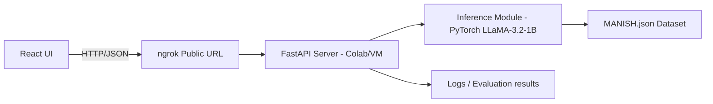
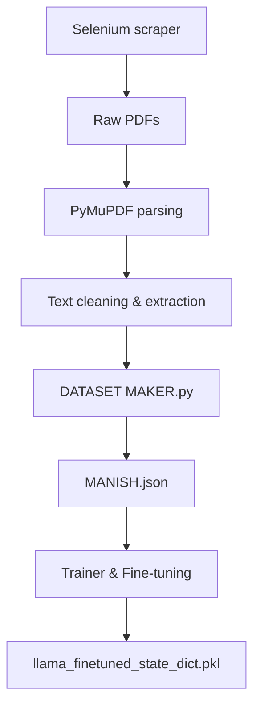

# System Architecture

LEXISIGHT relies on a split-stack architecture with a React frontend and a Python/FastAPI backend, leveraging a fine-tuned LLM for legal reasoning.

## 🌐 High-Level Architecture

The system consists of the following key components:

1.  **Frontend (React)**: User interface for submitting queries and viewing legal analysis.
2.  **Public Tunnel (ngrok)**: Exposes the backend (running in Colab/local) to the internet via a secure tunnel.
3.  **Backend (FastAPI)**: Handles API requests, loads the model, and manages inference logic.
4.  **Inference Module (LLaMA-3.2-1B)**: The core AI engine that generates questions and analysis.
5.  **Knowledge Base (MANISH.json)**: A structured dataset of Indian Contract Law cases used for training and potentially retrieval/reference.

### Diagram

## 🔄 Data Pipeline

The data pipeline describes how raw legal documents are transformed into the dataset used to train the model.

1.  **Data Collection**:
    *   **Source**: Indian Kanoon.
    *   **Tool**: Selenium script (`data collection using selenium.py`).
    *   **Output**: Raw PDFs of court judgments.

2.  **Preprocessing**:
    *   **Parsing**: PyMuPDF extracts text from PDFs.
    *   **Cleaning**: Removal of noise and formatting issues.

3.  **Dataset Creation**:
    *   **Tool**: `DATASET MAKER.py`.
    *   **Process**: Structures the raw text into a JSON format with specific fields (summary, questions, sections, etc.).
    *   **Output**: `MANISH.json`.

4.  **Model Training**:
    *   **Input**: `MANISH.json`.
    *   **Process**: Fine-tuning LLaMA-3.2-1B using Hugging Face Trainer.
    *   **Output**: `llama_finetuned_state_dict.pkl`.

### Pipeline Diagram

